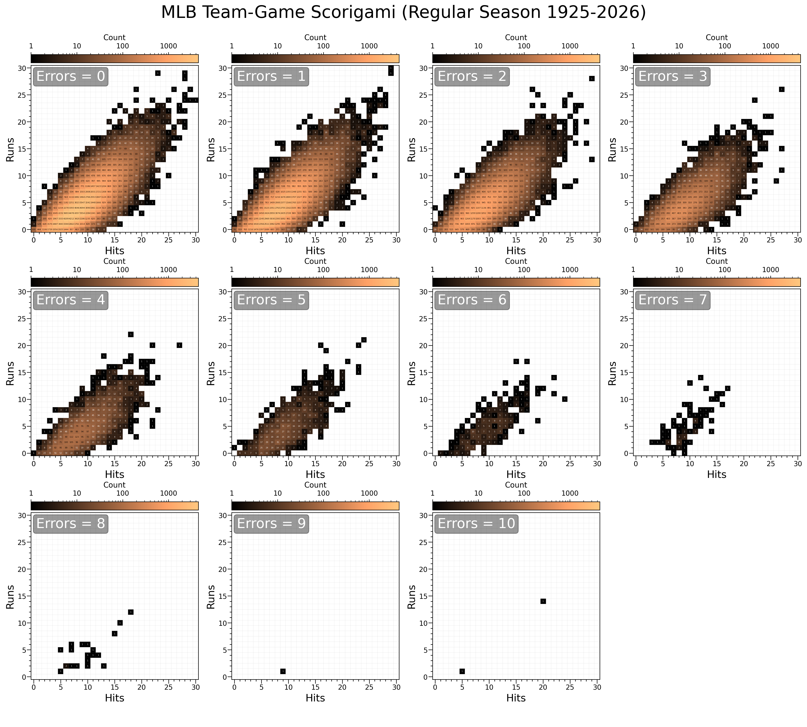

#  MLB Box Scorigami Pipeline

This folder contains a script that creates some fun visualizations of MLB team box-Scorigami data. Inspired by [the twitter account](https://x.com/NFL_Scorigami), I threw together this script which fetches game logs from 1925-today, keeping track of unique runs/hits/error combinations at the team level.

## Most Recent Scorigamis



| Hits | Runs | Errors | First Appearance | Team | Total Games |
|------|------|--------|------------------|------|-------------|
| 24 | 20 | 2 | 2025-08-06 | TOR | 1 |
| 25 | 24 | 1 | 2025-04-20 | CIN | 1 |
| 16 | 20 | 5 | 2025-03-29 | NYA | 1 |
| 25 | 17 | 0 | 2023-08-24 | BOS | 2 |
| 28 | 25 | 0 | 2023-06-24 | ANA | 1 |
| 27 | 20 | 0 | 2023-05-23 | TOR | 2 |
| 12 | 16 | 2 | 2023-05-18 | SLN | 1 |
| 11 | 17 | 0 | 2023-04-14 | NYN | 1 |
| 8 | 13 | 1 | 2022-10-01 | SLN | 1 |
| 29 | 28 | 2 | 2022-07-22 | TOR | 1 |

## Run

```bash
python build_scorigami_dataset.py
```

## Cache Notes

- If `data/box_scores_YYYY.parquet` exists, it loads that instead of re-downloading/re-parsing.
- If a year must be parsed and `raw/retrosheet_gamelogs/glYYYY.zip` exists, it reads the local zip instead of downloading.

## Outputs

- `/data/box_scores_YYYY.parquet`: one parquet per season (`1925` ... `2025`).
- `/data/box_scores_1925_2025_master.parquet`: all seasons combined.
- `/plots/master_scorigami_1925_2025.png`: R/H heatmaps faceted by errors (master scorigami).
- `/plots/franchises/*.png`: one error-faceted scorigami plot per franchise (e.g., `CLE.png`).
- `/plots/franchise_combo_tracking_1925_2025.png`: cumulative unique R/H/E combos by franchise over time.
- `/validation/validation_checks.csv`: pass/fail checks.
- `/validation/games_by_year.csv`: game and team-game totals per year.
- `/validation/team_games_by_year.csv`: franchise team-games by season.
- `/validation/team_games_outliers.csv`: any out-of-range team-season totals.
- `/validation/error_distribution.csv`: team-game counts by error total.
- `/validation/panel_sanity.csv`: by-error diagnostics for `runs <= hits` vs `runs > hits`.
- `/validation/spot_checks_sample.csv`: sampled raw Retrosheet rows matched against parsed output.
- `/validation/franchise_combo_tracking.csv`: data behind franchise combo tracking plot.

## Data Notes

- Source: Retrosheet yearly regular-season game logs (`glYYYY.zip`).
- Historical franchise continuity is normalized (for example: `BRO->LAD`, `NY1->SF`, `BSN/MLN->ATL`, `SLA->BAL`, `WS1->MIN`, `WS2->TEX`, `PHA/KC1/ATH->OAK`, `SE1->MIL`, `CAL->LAA`).
- Athletics relocation handling: Retrosheet `ATH` (2025) is normalized to `OAK` franchise.
- Expos/Nationals (`MON`/`WAS`) are normalized to `WSN`.
